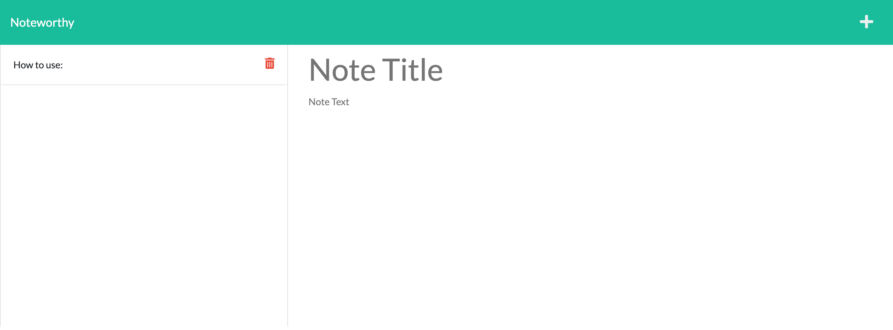

# Noteworthy: the Note Taker App

## Table of Contents

* [Description](#description)

* [Installation](#installation)

* [Usage](#usage)

* [License](#license)

* [Contributer](#contributer)

* [Tests](#tests)

* [Questions](#questions)
 
 ## [Description](#table-of-contents)
 This is an app to help the user save notes to review at any time. The user can add and delete notes as they see fit.

 

 Deployed app: [Noteworthy](https://dry-badlands-33193.herokuapp.com/)
 ## [Installation](#table-of-contents)
 1. Clone this repository 
 2. Install the associated packages by opening the integrated terminal and using npm i 
 3. To run it use npm start and follow the link to the live port. 

 ## [Usage](#table-of-contents)
To keep track of your notes, can be shopping lists, school notes, whatever the user may need to save.

 ## [License](#table-of-contents) 
This project is under the following license: 
 

 ## [Contributer](#table-of-contents)
 Denver University Coding Bootcamp for the Starter Code

 ## [Questions](#table-of-contents)

 To see my other work take a look at my public repositories on github:

 Github: [Github Link](https://github.com/moyuh)

 To contact me directly please reach out to the following email:

 Email: [mlroth94@gmail.com](mailto:mlroth94@gmail.com)

